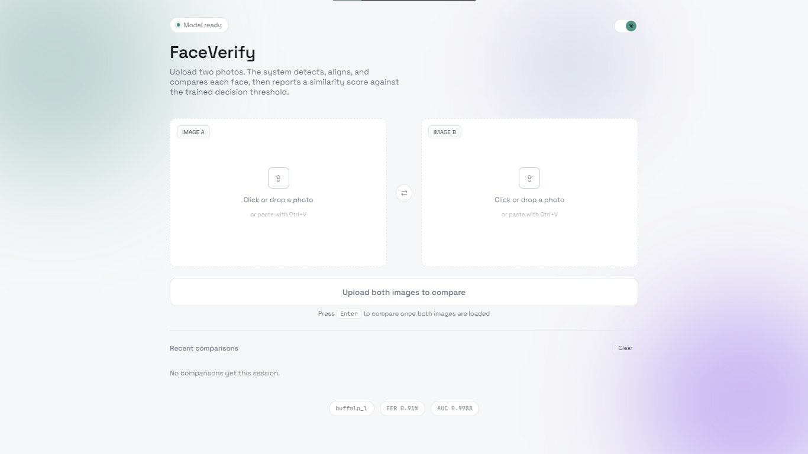
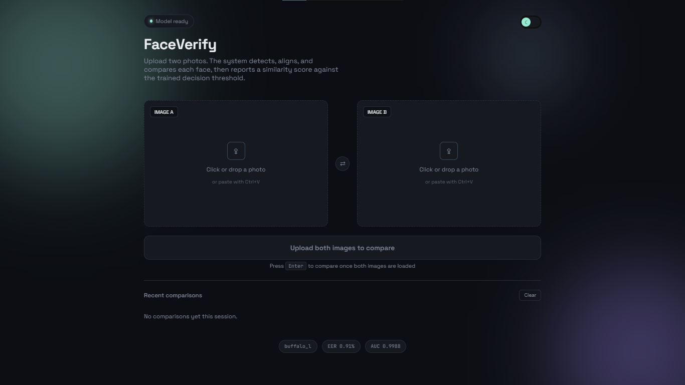
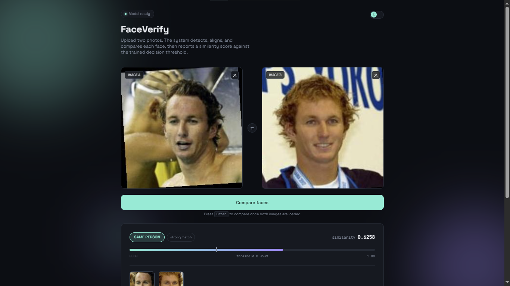
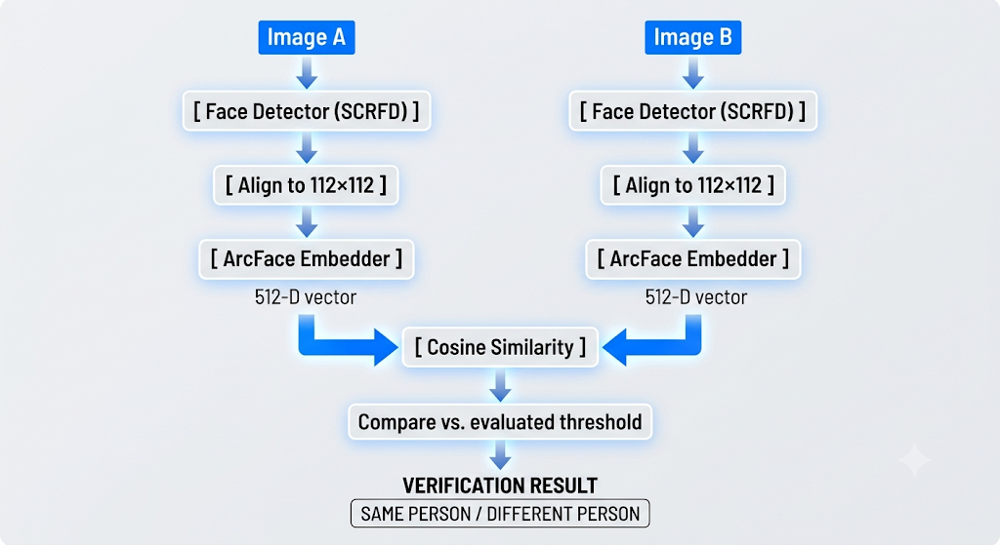

# Face Verification System

A production-style face verification pipeline built on **InsightFace / ArcFace**. Upload two photos and the system detects, aligns, and compares the faces, returning a similarity score and a SAME / DIFFERENT PERSON decision — backed by a properly evaluated, data-driven decision threshold (not a guessed number).

## What it does

- Detects a face in each image and aligns it to a standard 112×112 crop
- Extracts a 512-D embedding using a pretrained ArcFace recognition model
- Compares the two embeddings with cosine similarity
- Classifies the pair as the same person or different people, using a threshold computed from ROC/EER analysis on a real evaluation dataset — not hardcoded
- Exposes this as both a CLI tool and a REST API, with a web frontend on top

## Demo





## Architecture


## Tech stack

| Layer | Technology |
|---|---|
| Face detection & alignment | InsightFace (SCRFD) |
| Face recognition / embeddings | ArcFace (buffalo_l model pack) |
| Inference runtime | ONNX Runtime (CPU) |
| Backend API | FastAPI |
| Evaluation | scikit-learn (ROC curve, AUC), custom EER computation |
| Frontend | Vanilla HTML/CSS/JS (no framework) |

## Evaluation results

Evaluated on a self-collected dataset of 5 people (24 images, 229 same/different pairs):

| Metric | Value |
|---|---|
| AUC | 0.9989 |
| EER (Equal Error Rate) | 0.98% |
| Decision threshold (at EER) | ~0.354 |

Run `python evaluate.py` on your own dataset to regenerate these numbers — the threshold used by the app is loaded automatically from `data/threshold.json` after each evaluation run, no manual editing required.

## Project structure
```text
FaceVerify/
├── app/
│   ├── static/
│   │   └── index.html             # Web frontend UI
│   └── main.py                    # FastAPI application API
├── data/
│   ├── dataset/                   # Local image directory
│   └── threshold.json             # Evaluated threshold configuration (auto-generated)
├── src/
│   ├── config.py                  # Central configuration
│   ├── detector.py                # Face detection and alignment logic
│   ├── embedder.py                # ArcFace feature vector extraction
│   └── similarity.py              # Cosine similarity calculations & decision engine
├── evaluate.py                    # ROC curve & Equal Error Rate (EER) evaluation pipeline
├── main.py                        # End-to-end CLI execution interface
├── test_setup.py                  # Environment verification test
├── test_detector.py               # Unit tests for face detection module
├── test_embedder.py               # Unit tests for feature extraction module
├── test_similarity.py             # Unit tests for similarity calculation logic
└── requirements.txt               # Python package dependencies
```
## Setup

**Requirements:** Python 3.11 or 3.12 recommended (newer versions may lack prebuilt wheels for some dependencies). A C++ build toolchain is needed on some platforms — see Troubleshooting below.

``` bash
git clone https://github.com/anuragxtiwari/FaceVerify
cd FaceVerify

python -m venv venv
source venv/bin/activate      # Windows: venv\Scripts\activate

pip install -r requirements.txt
```

Verify the install:
```bash
python test_setup.py
```
This downloads the ArcFace model pack (~300MB, first run only) and confirms everything loads correctly.

## Usage

### Command line
```bash
python main.py path/to/image1.jpg path/to/image2.jpg
```

### Build your own evaluation dataset and recompute the threshold
Organize photos as:
``` text
data/dataset/
├── person_a/
│ ├── img1.jpg
│ └── img2.jpg
├── person_b/
│ ├── img1.jpg
│ └── img2.jpg
```
Then run:
```bash
python evaluate.py
```
This generates an ROC curve (`data/roc_curve.png`) and updates `data/threshold.json`, which the app picks up automatically.

### Run as a web app
```bash
uvicorn app.main:app --reload
```
Open `http://127.0.0.1:8000` for the frontend, or `http://127.0.0.1:8000/docs` for the interactive API docs.

## API reference

**`POST /verify`** — multipart form with two file uploads (`image1`, `image2`)

Response:
```json
{
  "same_person": true,
  "similarity": 0.6051,
  "threshold": 0.3539,
  "aligned1": "data:image/jpeg;base64,...",
  "aligned2": "data:image/jpeg;base64,..."
}
```

**`GET /model-info`** — returns the active model pack name and last evaluation's AUC/EER
**`GET /health`** — basic health check

## Troubleshooting

- **`Microsoft Visual C++ 14.0 or greater is required`** (Windows) — install the "Desktop development with C++" workload from [VS Build Tools](https://visualstudio.microsoft.com/visual-cpp-build-tools/)
- **No prebuilt wheel for `numpy`/`onnxruntime`** — your Python version may be too new; use `numpy>=2.0.0` and `onnxruntime>=1.20.0`, or switch to Python 3.11/3.12
- **`NoFaceDetectedError`** — use a clearer, more frontal photo with adequate lighting

## Limitations

- Assumes one primary subject per photo (picks the largest detected face if multiple are present)
- Threshold is only as good as the evaluation dataset it was computed from — a small, homogeneous dataset will overstate real-world accuracy; add more people and images for a more robust threshold
- CPU-only inference by default (no GPU acceleration configured)

## Acknowledgments

- [InsightFace](https://github.com/deepinsight/insightface) for the detection and recognition models
- [ArcFace: Additive Angular Margin Loss for Deep Face Recognition](https://arxiv.org/abs/1801.07698) (Deng et al.)
